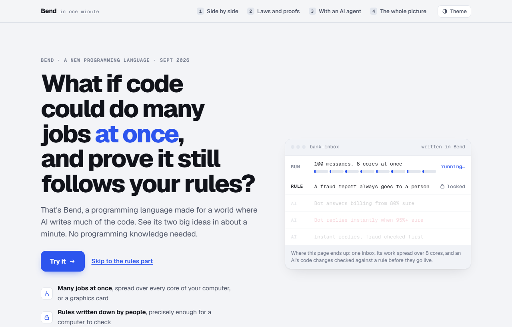
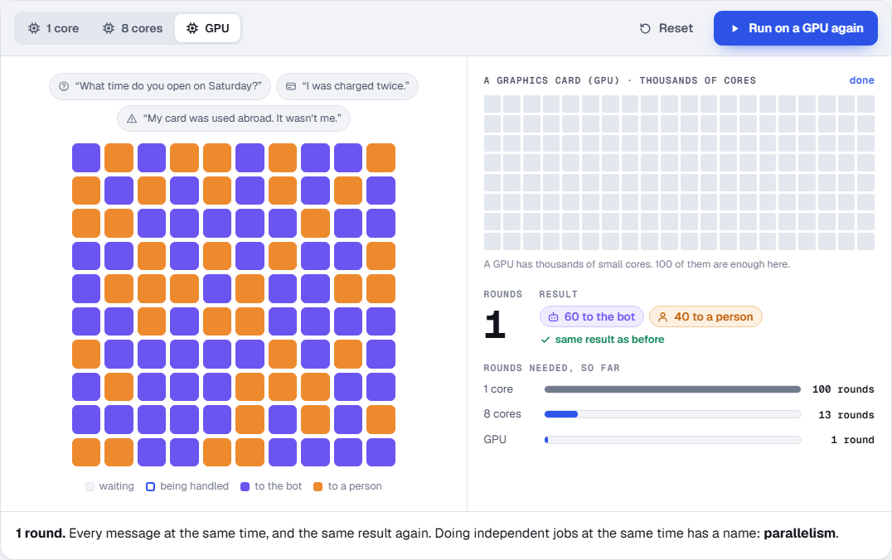
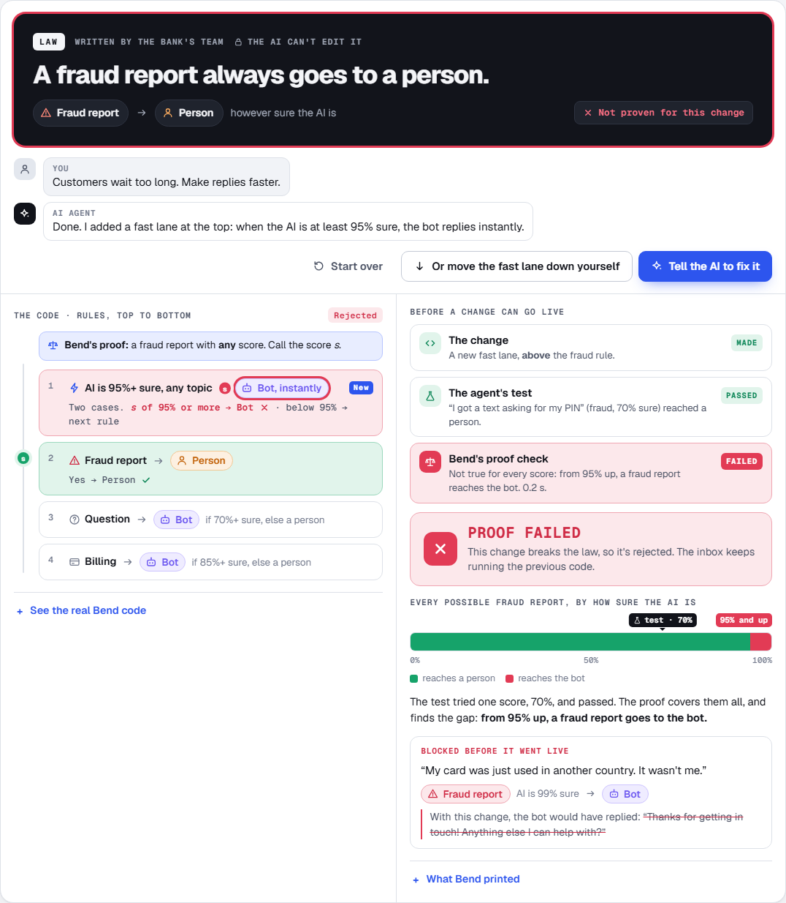
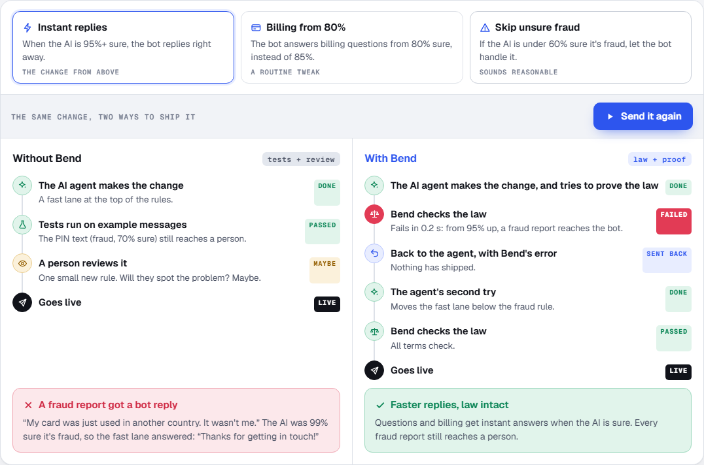

# Bend, Explained

An interactive, beginner-friendly explainer of [Bend](https://bend-lang.com/), a new programming language released in September 2026. It shows Bend's two big ideas with demos you can click, so someone who has never heard of Bend (or of programming languages) can understand what it does and why it is interesting.

**Live site:** https://raunak-11.github.io/bend-explainer/

| Version | Title | Status | Live URL |
|---|---|---|---|
| v3 | Bend in One Minute | Current | https://raunak-11.github.io/bend-explainer/v3/ |
| v2 | See what Bend does | Previous | https://raunak-11.github.io/bend-explainer/v2/ |

Each version has its own permanent address, so links to one keep working after a newer version is published. The site root is a small index that lists every version.



## Why this exists

Bend is usually described in technical terms: automatic parallelism across CPU and GPU cores, dependent types, laws and machine-checked proofs. Those descriptions are accurate but hard to follow unless you already know the vocabulary.

This project takes the opposite route. Each idea is shown first, with a demo, and only then given its name. The goal is that a business person, a non-programmer or a GenAI practitioner can explain Bend back in a few sentences after about a minute on the page:

1. **Side by side:** independent jobs can run at the same time. Bend spreads them over every core of a computer, or a GPU.
2. **Laws:** people write down, precisely, rules that must always be true.
3. **Proofs:** every code change, even one written by an AI, must come with a proof that the laws still hold. Bend checks the proof, and without one the change is not accepted.

## What's inside (v3)

v3 follows one story, a bank's AI support inbox, through four chapters.

| Chapter | What the visitor does | What it shows |
|---|---|---|
| 1. Side by side | Runs 100 messages on 1 core, 8 cores, then a GPU | 100, 13 and 1 rounds of work, with the same result every time. The word "parallelism" appears only after the demo. |
| 1. Where Bend comes in | Watches the inbox being split in two, again and again | How Bend's split-in-two parallel call shares work across cores or a GPU, with the matching line of Bend code highlighted at each step. |
| 2. Laws and proofs | Asks an AI agent to "make replies faster", then fixes the result | The agent's change passes its own test but fails Bend's proof. A strip covering every confidence score from 0% to 100% shows the gap the test missed. The fix passes. |
| 3. With an AI agent | Sends one of three changes down two roads | The same change shipped with tests and review only, and with a law and a proof. Safe changes pass both. |
| 4. The whole picture | Reads | Who writes what (people write laws, the AI writes code and proofs, Bend checks and runs), three sentences to remember, and Bend's own tagline in plain English. |

The page ends with what Bend does **not** promise, and a technical section with the full Bend source behind the demos.







### What's real and what's simulated

- **Real:** every version of the Bend code in v3 (the router, the law, the proof, and the parallel `triage` program) was run through the Bend checker, version 2.0.25. The pass and fail results, and the checker output shown on the page, are what it printed.
- **Simulated:** the round counts and timings in chapter 1 are a simplified model of Bend's scheduler, not measurements. The AI agent's messages are scripted. The "tests" and "review" steps in chapter 3 illustrate a typical workflow.
- Some figures quoted on the pages come from the author's own trial of Bend. The trial materials are not part of this repository.

### v2

v2, "See what Bend does", is the previous version: two demos, one on running independent work at the same time and one on checking that code obeys a rule you wrote down. It is kept online unchanged.

## Technology

- Plain HTML, CSS and JavaScript. No framework, no dependencies, no build step for the pages themselves.
- Each version is **one self-contained HTML file**: its styles, scripts and icons (inline SVG) all live inside it. Versions share no files, so one can't break another.
- Fonts: Geist and Geist Mono from Google Fonts (v3 and the index), with system-font fallbacks. v2 uses system fonts only.
- Light and dark themes (with a theme switch on each version), visible keyboard focus, and a reduced-motion mode where every demo jumps straight to its end state.
- Hosting: GitHub Pages, deployed by a GitHub Actions workflow.

## Repository structure

```
.
├── index.html                          Version index (the site root)
├── BEND-EXPLAINER_v3.html              Current version  -> /v3/
├── BEND-EXPLAINER_v2.html              Previous version -> /v2/
├── scripts/build-site.sh               Assembles the site in _site/
├── .github/workflows/deploy-pages.yml  Builds and deploys to GitHub Pages
├── docs/screenshots/                   Images used in this README
├── .gitignore                          An allowlist (see below)
└── README.md
```

`scripts/build-site.sh` copies `index.html` to the site root and each `BEND-EXPLAINER_vN.html` to `vN/index.html`. It fails the build if the index links to a version whose file is missing.

The `.gitignore` is an **allowlist**: everything is ignored unless it is listed. This keeps private working notes that live in the same folder out of the repository. If you add a new top-level file or folder that should be published, add a `!/name` line for it.

## Running it locally

No installation is needed. Open `BEND-EXPLAINER_v3.html` (or `_v2`) directly in a modern browser.

To preview the site exactly as it is deployed, with the index and the `/v2/` and `/v3/` addresses:

```sh
sh scripts/build-site.sh
python -m http.server 8000 --directory _site
```

Then open http://localhost:8000/. On Windows, run the script from Git Bash or WSL.

## Development

**Editing the current version:** edit `BEND-EXPLAINER_v3.html`, then open it in a browser and click through every demo. There is no build step and no test suite; every demo can be replayed, and the reduced-motion setting in your operating system is a quick way to check every end state.

**Publishing a new version:**

1. Copy the latest file to `BEND-EXPLAINER_v4.html` and make your changes there. Leave older versions as they are.
2. In `index.html`, add a card for v4, mark it as the current version, and mark v3 as previous.
3. Run `sh scripts/build-site.sh` and preview it as above.
4. Commit and push to `main`.

**Checking Bend code:** any Bend code shown on a page should be run through the real checker before it is published. Bend runs on Linux and macOS (on Windows, use WSL or Docker):

```sh
curl -fsSL https://bend-lang.com/install.sh | sh
bend file.bend
```

`bend` prints `All terms check.` when every law in the file is proven. See the [Bend guide](https://github.com/bendlang/bend/blob/main/guide/GUIDE.md) for the language itself.

**Writing style:** plain language first, terms after the demo that shows them, and no claims beyond what Bend and its documentation support. The pages avoid em dashes.

## Deployment

Every push to `main` runs `.github/workflows/deploy-pages.yml`, which builds `_site/` with `scripts/build-site.sh` and deploys it to GitHub Pages. You can also run the workflow by hand from the Actions tab.

In the repository settings, **Pages → Build and deployment → Source** must be set to **GitHub Actions**. No secrets or environment variables are needed.

## Limitations

- This is an independent explainer. It is not made by, or affiliated with, the Bend project or the Higher Order Company.
- Bend 2 is young. Its own guide says to expect bugs, and the pages explain an idea rather than recommend Bend for production.
- The pages deliberately simplify. Bend proves only the laws someone writes down; it does not make code bug-free, prove anything about AI models, or make every workload faster. The limits section in v3 covers this in more detail.
- GPU speed is not measured by this project. The GPU version of the demo program compiles, but was only run with the GPU switched off.

## Contributing

Suggestions and corrections are welcome through issues and pull requests. Accuracy matters most here: if you change a claim about Bend, link to the source that supports it, and run any Bend code you add through the checker.

## License

No license has been chosen for this project yet. Until one is added, default copyright applies: you can view and fork the repository on GitHub, but reusing the code or content elsewhere needs the author's permission.

Bend itself is developed by Victor Taelin and the Higher Order Company: [bend-lang.com](https://bend-lang.com/) · [github.com/bendlang/bend](https://github.com/bendlang/bend).
